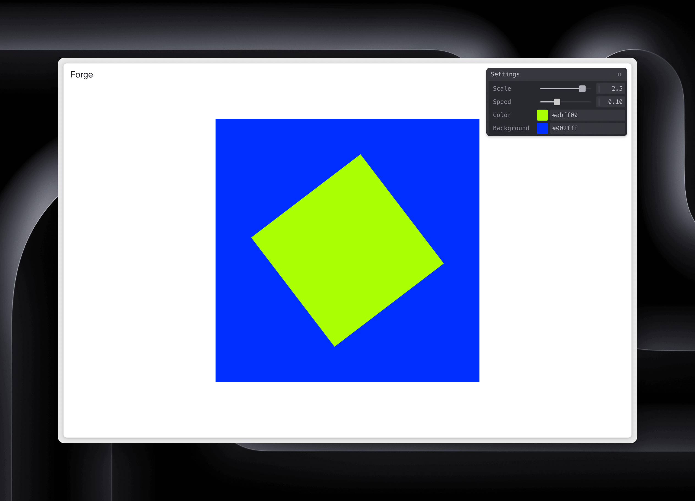

# Forge CC

A HTML/CSS/TypeScript creative coding project built with P5.js, featuring an interactive canvas with customizable settings

## Features

- Interactive canvas with P5.js
- Real-time parameter adjustments using Tweakpane
- TypeScript for type safety and better development experience

## Tech Stack

- TypeScript
- P5.js for creative coding
- Tweakpane for GUI controls

## Project Structure

- `src/main.ts` - The main entry point for the project
- `src/style.css` - The CSS file for the project
- `index.html` - The HTML file for the project

## Local Development

1. Clone the repository
2. Run `npm install` to install the dependencies
3. Run `npm run dev` to start the development server
4. Open `http://localhost:5173` in your browser to view the project
5. Run `npm run build` to build the project
6. Run `npm run preview` to preview the project

